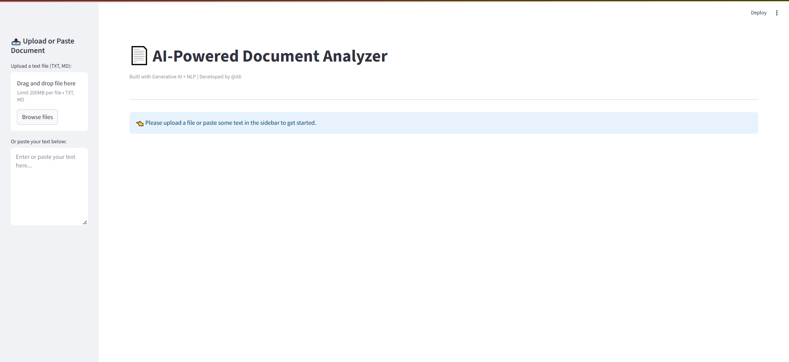

#  AI Document Analyzer

AI Document Analyzer is a fast and easy tool for analyzing text documents using Python and Streamlit.  
It accepts text files (TXT, MD), processes content with NLP and Generative AI to extract:

- Named Entities  
- Sentiment Analysis  
- Extractive and Abstractive Summaries  
- Answers to user questions about the document  

---

## Live Demo (Streamlit Interface)



---

## Features

- Upload or paste text documents (TXT, MD)  
- Extractive summarization using TF-IDF and cosine similarity  
- Abstractive summarization powered by OpenAI GPT  
- Named Entity Recognition (NER) with spaCy  
- Sentiment analysis with timeline visualization  
- Ask natural language questions and get AI-generated answers  

---

## Tech Stack

- Python 3.10+  
- Streamlit  
- spaCy  
- TextBlob  
- scikit-learn  
- OpenAI API (GPT-3.5-turbo)  
- Plotly  

---

## Project Structure

```bash
ai-doc-analyzer/
├── app/
│   └── app_streamlit.py           
├── modules/
│   ├── spacy_nlp.py               
│   ├── llm_processor.py           
│   ├── summarizer.py              
│   ├── visualizer.py             
├── run.py                         
├── requirements.txt              
├── README.md                     
